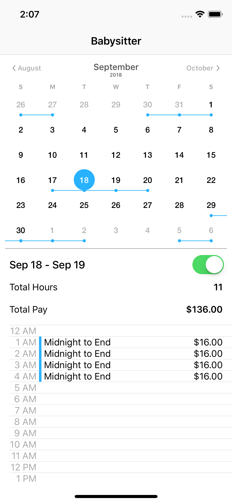
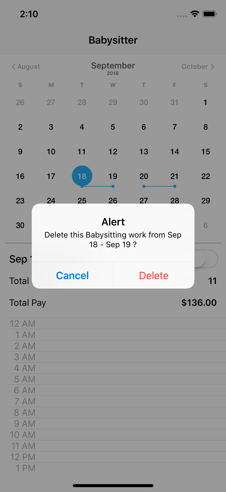

# Babysitter Kata

## Background
This kata simulates a babysitter working and getting paid for one night.  The rules are pretty straight forward.

The babysitter:
- starts no earlier than 5:00PM
- leaves no later than 4:00AM
- gets paid $12/hour from start-time to bedtime
- gets paid $8/hour from bedtime to midnight
- gets paid $16/hour from midnight to end of job
- gets paid for full hours (no fractional hours)


## Feature
*As a babysitter<br>
In order to get paid for 1 night of work<br>
I want to calculate my nightly charge<br>*

## Implementation



This is an iOS implementation using the MVVC design framework. The UI and user interaction are handled by the `CalendarViewController` (the View in the MVVC) and additional `UITableViewCell` subclasses, namely: `ActionTableViewCell` and `TimeTableViewCell`. 

Business logic and data representation are handled by `CalendarViewModel` (the ViewModel in the MVVC). Core Data operations are delegated to the `CoreDataAPI` class.

The `WorkModel` (`NSManagedObject` subclass) is the Model in the MVVC. It represents the nightly Babysitting work.

The user may toggle the `UIControlSwitch` to save/delete a Babysitting work. Total hours and total pay are then calculated and saved to Core Data.

When the app is restarted, saved Babysitting works should be displayed in the calendar.

## Cloning
Clone the repository and open the Xcode workspace file. There is no need to fetch Cocoapod dependencies as they are already included in the repository.

```
$git clone https://github.com/jovito-royeca/kata-babysitter.git
$cd kata-babysitter
$open Babysitter.xcworkspace
```

